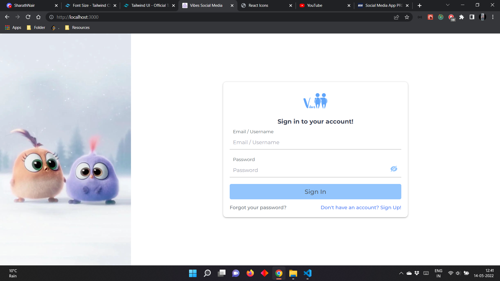
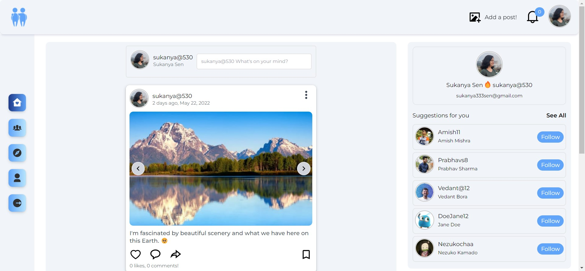
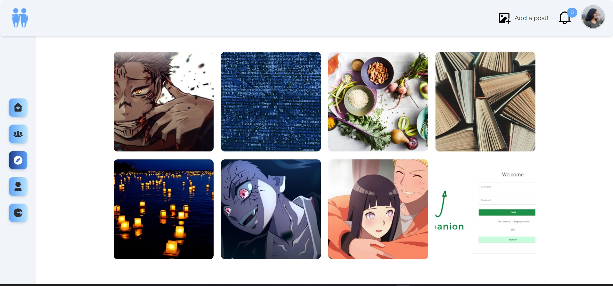

#### (WeebO-frontend)

  

   # [Vibes](https://weebofigurines.vercel.app/)
   Social media for sharing photos :)

## Stack Used

- React
- SCSS
- Javascript

## Built With -

- Redux Toolkit with RTK query
- React Router v6

### Features

- Feed page
  - User can see posts of people she/he follows
  - Suggestions of common users to follow (followers of following)
- Explore Page
  - User can see posts of common followers
- People Page
  - User can search user 
- Profile Page
  - User can edit details - avatar , banner and other 
  details
  - See other user's profile page
  - Follow/Unfollow user
  - See followers and following list
  - Check their posts
  - Check saved posts
  - Check liked posts
- Posts
  - Create a post with multiple photos and emoji support
  - Update a post
  - Delete a post
  - Like/Dislike posts
- Comments
  - Add a comment with emoji
  - Delete their own comment
  - Update their own comment
- 404 Page for unavailable routes
- Authentication:
  - User Signup
  - User Login
  - Forgot password
  - Reset password
- Persistent login with cookies - 30 days once logged in until you logout!
- Loading and alerts for all actions.

#### Backend for this project - [Vibes-backend](https://github.com/SukanyaSen530/Vibes-backend)

# Images

 

 

  Checkout the app to see all the features :)